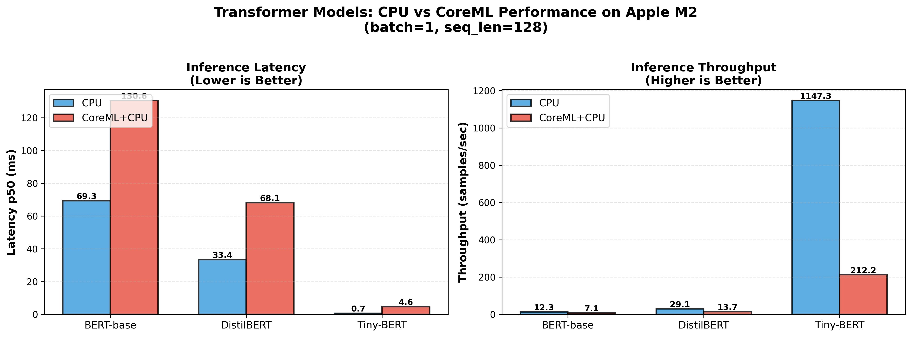
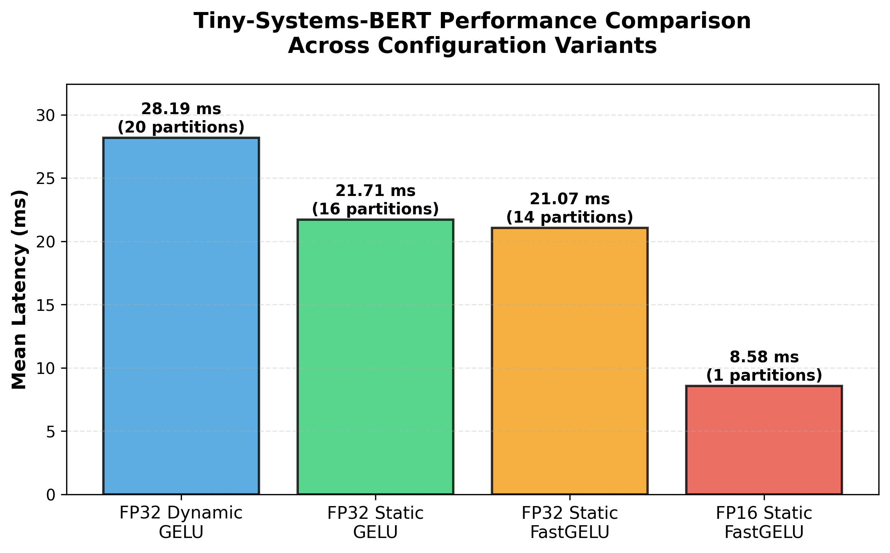

# 📘 CoreML Execution Provider: Systems-Level Performance Study

### Diagnosing inference performance, graph partitioning, and accelerator offload on Apple Silicon

---

## 1. Abstract

This project is a systems-level investigation into **inference performance on Apple Silicon** using **ONNX Runtime (ORT) with the CoreML Execution Provider (EP)**. Rather than benchmarking raw speedups, the goal is to understand *why* CoreML acceleration succeeds or fails across different models, dtypes, and graph structures.

Through controlled experiments on small Transformer models and a vision control model (MobileNet), this work characterizes:

- graph partitioning and fragmentation behavior  
- CPU fallback mechanisms  
- frontend dtype compatibility  
- dispatch and transition overhead  
- conditions under which CoreML provides real acceleration  

The results show that **frontend compatibility and graph structure dominate performance**, often outweighing theoretical hardware advantages of the Apple Neural Engine (ANE).

---

## 2. Motivation

Apple’s CoreML stack is widely used for deploying ML models on edge devices, yet developers frequently encounter confusing performance outcomes:

- CoreML sometimes underperforms CPU execution  
- FP16 models can be slower than FP32  
- Accelerators appear enabled but provide little benefit  
- Performance changes dramatically with minor graph edits  

This project addresses a practical question:

> **When should CoreML be used for inference — and when should it not?**

Rather than treating CoreML as a black box, we use **profiling, graph analysis, and controlled ablations** to surface the mechanisms that govern runtime behavior.

---

## 3. Experimental Scope

### Models
- **Transformer family**
  - BERT-derived small Transformer variants
  - Focus on batch-1 / latency-sensitive inference
- **Vision control**
  - MobileNet (convolutional workload)

### Runtime
- ONNX Runtime  
  - CPUExecutionProvider  
  - CoreMLExecutionProvider (with CPU fallback)

### Hardware
- Apple Silicon (M-series)  
  - CPU  
  - CoreML backend (ANE / GPU selected internally)

### Profiling
- ORT JSON profiler  
- Per-node kernel execution times  
- Partition count and provider assignment  

---

## 4. Key Observations

### 4.1 CoreML Performance Anomaly

First, we benchmarked the BERT-base-uncased transformer on CPU vs CoreML and found CPU outperformed CoreML by a wide margin.


BERT has roughly:
- 110M parameters
- 12 transformer encoder layers
- Hidden size 768, Vocabulary size ~30k

Initial profiling reveals:
- heavy graph fragmentation  
- frequent CPU↔CoreML transitions  
- significant dispatch overhead  

One hypothesis is that model scale or embedding footprint may contributes to fragmentation; however, because CoreML internals are proprietary, we test this empirically by reducing model depth and hidden size.

Much of the CoreML architecture and specs are propriatary and not made publicly available. We can only obtain system insights by stress testing CoreML.



DistilBERT has roughly:
- ~66M parameters
- 6 transformer layers (vs 12)
- Hidden size 768

Tiny Systems Bert has roughly:
  - ~4.4M parameters
  - 2 transformer layers
  - Hidden size 128

Our benchmark results across different models shows that latency and throughput improved from utilizing models with reduced layers or hidden size. However, CoreML consistently underperformed CPU by a wide margin even when model size was reduced.

This motivates a deeper diagnosis.

---

### 4.2 Graph Fragmentation, Not Memory, Is the Bottleneck

ORT partitions the ONNX graph into multiple CoreML subgraphs separated by CPU-only operators. On tiny-systems-bert, profiling revealed the inference timeline bouncing across twenty CoreML islands, with executor overhead dominating runtime (Appendix A). The same handful of CPU-only ops—`Erf`, `Where`, `Cast`, `Expand`, `Unsqueeze`—keep slicing up the graph, so batching merely amortizes the cost instead of removing it. Fragmentation, not raw compute, is the bottleneck.

In sections 4.3 - 4.5, we will explore and explain how model shape, activation function, and model precision impacts graph fragmentation and overall performance.



---

### 4.3 Static Shapes Are Mandatory for Stable Behavior

Dynamic shapes force ORT to run extra shape-resolution ops on the CPU, which in turn keeps fragmenting the CoreML partitions (Appendix A). Exporting the same model with fixed batch/sequence removes that plumbing: the graph shrinks, partitions become fewer but larger, and CoreML covers most nodes (Appendix B). Static shapes act as hard contracts that stabilize both performance and profiling.

---

### 4.4 Targeted Graph Intervention: GELU → FastGELU

Profiling identifies `Erf` as a dominant CPU cut-maker.

Swapping GELU for **FastGELU** removes the `Erf` ops that were cutting the graph, so CoreML executes longer stretches before bouncing to CPU (Appendix C). The end result is only a few percent faster, but it eliminates an entire class of CPU bottlenecks and simplifies later FP16 experiments. Small, targeted graph edits beat broad “tune everything” attempts.

---

### 4.5 Dtype Pitfall: FP16 Can Disable Acceleration

Contrary to intuition:

- **FP16 ONNX models often fail CoreML partitioning**  
- Execution silently falls back to CPU  
- Partition count may decrease *only because offload disappears*  

In contrast:
- **FP32 ONNX graphs are more reliably ingested**  
- CoreML EP internally lowers precision as needed  
- Full accelerator offload becomes possible  

The reduced latency observed in this configuration is not due to improved CoreML partitioning under FP16, but rather because most operators fall back to CPU execution (Appendix D). When plotting CPU vs CoreML in this configuration (static batching, fast-relu, and FP16 precision), we observe much overlap in performance.


This shows that **user-visible dtype ≠ execution dtype** in CoreML.

---

### 4.6 Control Experiment: MobileNet on CoreML

To verify that CoreML is not inherently inferior, we benchmark MobileNet on CoreML and CPU across FP32 and FP16 precisions:


- FP32 ONNX → 100% CoreML partition  
- No fragmentation  
- ~16× speedup over CPU  

This confirms:
- CoreML excels on workloads with strong op coverage  
- Performance failures in Transformers are **structural**, not hardware limitations  

---

## 5. Key Takeaways for Edge Deployment

For developers deploying ML on Apple devices:

- **Do not assume FP16 is faster**  
- **Measure offload coverage**, not just latency  
- **Static shapes are critical** for production inference  
- **Accelerators are not free** — dispatch overhead matters  
- **CPU execution may be the correct choice** for some NLP workloads  
- **Vision models benefit far more reliably** from CoreML  

---

## 6. Repository Layout

```
coreml-ep-performance-study/
├── bench/                 # benchmarking utilities, model loader helpers
├── models/                # exported ONNX artifacts (various dtypes/batches)
├── scripts/               # experiment + plotting entry points
│   ├── run_mac_bench.py                # main benchmark/profiling driver
│   ├── run_mobilenet_comparison.py     # FP16 vs FP32 MobileNet study
│   ├── plot_batch_scaling.py           # CPU/CoreML batch sweep figure
│   ├── export_vision_to_onnx.py        # MobileNet export helper
│   ├── export_to_onnx.py               # transformer export pipeline
│   ├── summarize_ort_profile.py        # converts raw ORT traces → summaries
│   └── analyze_fragmentation.py        # partition/coverage post-processing
├── results/
│   ├── plots/             # figures referenced throughout the report
│   ├── csv/               # benchmark tables (latency/throughput)
│   └── txt/               # profiler summaries cited in §4
├── profiles/              # raw ORT JSON traces (regenerate via scripts)
├── notebooks/             # exploratory analysis + scratch plotting
├── tiny-systems-bert/     # training/config assets for control model
└── requirements.txt       # Apple Silicon environment dependencies
```

---

## 7. Reproducibility

The repository includes:
- representative profiler traces  
- summarized results  
- scripts to regenerate figures  

Due to hardware dependence, **full reproduction requires Apple Silicon**, but analysis scripts are portable.

---

## 8. Conclusion

This project reframes CoreML performance from a “speedup problem” into a **systems diagnosis problem**.

The central insight is that **frontend compatibility and graph structure govern accelerator effectiveness** far more than raw compute capability. By understanding these boundaries, developers can make informed decisions about when CoreML will help — and when it will not.

---

## 9. Evidence & Profiling References

Detailed per-kernel traces, executor breakdowns, and exact timing measurements
supporting Sections 4.2–4.4 are provided below for reproducibility.

Profiling reference run: `results/txt/tiny-systems-bert_fp32_dynamic_gelu_profile_summary.txt`

### Appendix A — tiny-systems-bert FP32 dynamic (baseline)

- Total duration: 2.96 s
- CoreML partitions: 20
- Nodes: 167 (CoreML: 142)
- Executor time: 841 ms
- Dominant CPU ops: Erf, Where, Cast, Expand

[Full profile summary](results/txt/tiny-systems-bert_fp32_dynamic_gelu_profile_summary.txt)

---

### Appendix B — tiny-systems-bert FP32 static (b1, s128)

Profiling reference run: `results/txt/tiny-systems-bert_fp32_static_b1_s128_gelu_profile_summary.txt`

- Total duration: 2.28 s  
- CoreML partitions: 16  
- Nodes: 125 (CoreML: 100)  
- Executor time: 545 ms  
- CPU ops dominated by Erf (~40 ms total), minor Where/Cast/Expand

This run demonstrates §4.3’s claim: locking shapes removes shape-handling overhead, shrinks the graph, and yields higher throughput with fewer—but higher-quality—partitions.

[Full profile summary](results/txt/tiny-systems-bert_fp32_static_b1_s128_gelu_profile_summary.txt)

---

### Appendix C — tiny-systems-bert FP32 static + FastGELU

Profiling reference run: `results/txt/tiny-systems-bert_fp32_static_b1_s128_fast-gelu_profile_summary.txt`

- Total duration: 2.21 s  
- CoreML partitions: 14  
- Nodes: 133 (CoreML: 110)  
- Executor time: 533 ms  
- CPU fallback limited to Where/Cast/Expand (~5 ms); no Erf kernels remain

Appendix C supports §4.4 by showing how FastGELU eliminates `Erf` bottlenecks, enabling longer CoreML segments even though the partition count drops.

[Full profile summary](results/txt/tiny-systems-bert_fp32_static_b1_s128_fast-gelu_profile_summary.txt)

---

### Appendix D — tiny-systems-bert FP16 static + FastGELU

Profiling reference run: `results/txt/tiny-systems-bert_fp16_static_b1_s128_fast-gelu_profile_summary.txt`

- Total duration: 0.90 s  
- CoreML partitions: 14  
- Nodes: 133 (CoreML: 110)  
- Executor time: 287 ms  
- All heavy ops run on CoreML; CPU work limited to lightweight control ops

This run highlights §4.5: The FP16 export executes almost entirely on CPU with minimal CPU/CoreML tansitions. The reduced latency observed in this configuration is not due to improved CoreML partitioning under FP16, but rather because most operators fall back to CPU execution.

[Full profile summary](results/txt/tiny-systems-bert_fp16_static_b1_s128_fast-gelu_profile_summary.txt)

---

### Appendix E — Example Workflow Commands

Complete end-to-end pipeline for benchmarking and analyzing a model:

#### Step 1: Export Model to ONNX

**Note:** The `--output-name` should match the original model name (e.g., `tiny-systems-bert`) for tokenizer inference to work in the benchmarking script.

```bash
# Export with static shapes (recommended for CoreML)
python3 scripts/export_to_onnx.py \
  --model-name tiny-systems-bert \
  --batch 1 \
  --max-length 128 \
  --static-shapes \
  --output-name tiny-systems-bert_b1_s128_gelu_fp32

# Export with FastGELU activation (eliminates Erf bottleneck)
python3 scripts/export_to_onnx.py \
  --model-name tiny-systems-bert \
  --batch 1 \
  --max-length 128 \
  --static-shapes \
  --fast-gelu \
  --output-name tiny-systems-bert_b1_s128_fast-gelu_fp32

# Export with FP16 precision
python3 scripts/export_to_onnx.py \
  --model-name tiny-systems-bert \
  --batch 1 \
  --max-length 128 \
  --static-shapes \
  --fast-gelu \
  --fp16 \
  --output-name tiny-systems-bert_b1_s128_fast-gelu_fp16
```

#### Step 2: Run Benchmark with Profiling

```bash
# Benchmark with CoreML EP (generates profile JSON)
python3 scripts/run_mac_bench.py \
  --model tiny-systems-bert_b1_s128_gelu_fp32 \
  --ep coreml_cpu \
  --batch 1 \
  --seq-len 128 \
  --profile-dir profiles

# The script automatically:
# - Runs benchmark (100 iterations with 5 warmup)
# - Generates profile JSON in profiles/
# - Creates human-readable summary via summarize_ort_profile.py
# - Reports latency (p50, p90, p99) and throughput
``` 

#### Step 3: Analyze Fragmentation

```bash
# Compare graph fragmentation across models
python3 scripts/analyze_fragmentation.py

# Output shows:
# - CoreML partition count
# - CPU vs CoreML operation breakdown
# - Execution time distribution
# - Unique CPU fallback operations
```

#### Step 4: Generate Comparison Plots

```bash
# Compare configurations side-by-side
python3 scripts/plot_profile_comparison.py

# Consolidate all transformer results
python3 scripts/plot_consolidated_comparison.py

# Run complete MobileNet comparison study
python3 scripts/run_mobilenet_comparison.py
```

#### Example: Complete Analysis Pipeline

```bash
# 1. Export static FP32 with GELU
python3 scripts/export_to_onnx.py \
  --model-name tiny-systems-bert \
  --batch 1 --max-length 128 \
  --static-shapes \
  --output-name tiny-systems-bert_b1_s128_gelu_fp32

# 2. Benchmark with profiling
python3 scripts/run_mac_bench.py \
  --model tiny-systems-bert_b1_s128_gelu_fp32 \
  --ep coreml_cpu \
  --batch 1 --seq-len 128 \
  --profile-dir profiles

# 3. Profile summary is auto-generated at:
# profiles/tiny-systems-bert_b1_s128_gelu_fp32_b1_s128_CoreMLExecutionProvider_CPUExecutionProvider_summary.txt

# 4. Copy to results for documentation
cp profiles/tiny-systems-bert_b1_s128_gelu_fp32_*_summary.txt \
   results/txt/

# 5. Analyze fragmentation patterns
python3 scripts/analyze_fragmentation.py

# 6. Generate comparison visualizations
python3 scripts/plot_profile_comparison.py
```

#### Quick Reference: Key Flags

- `--static-shapes`: Fix batch/seq dimensions (required for stable CoreML behavior)
- `--fast-gelu`: Replace GELU with tanh approximation (eliminates Erf CPU fallback)
- `--fp16`: Export in FP16 precision (may fail CoreML partitioning)
- `--ep coreml_cpu`: Use CoreML with CPU fallback
- `--ep cpu`: CPU-only baseline for comparison
- `--profile-dir profiles`: Enable profiling and save to profiles/

---
