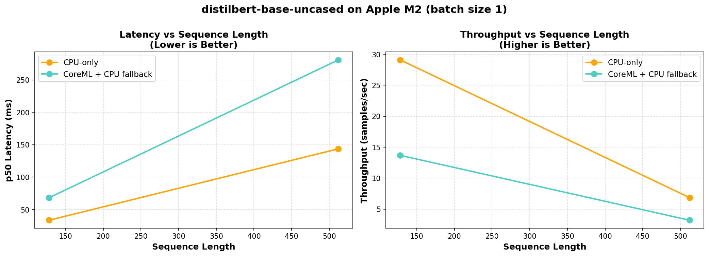
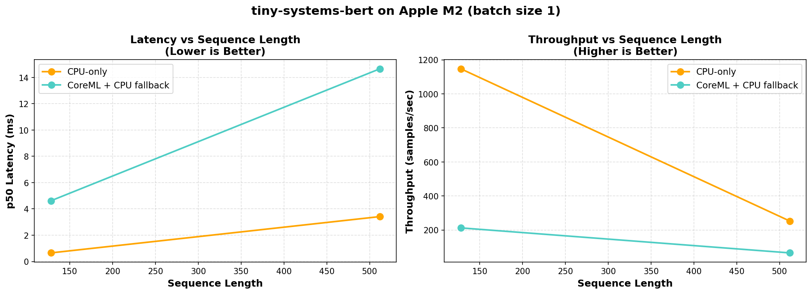
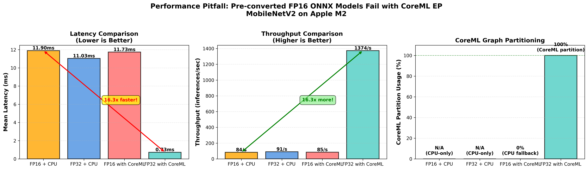

# 📘 CoreML Execution Provider: Systems-Level Performance Study

### Diagnosing inference performance, graph partitioning, and accelerator offload on Apple Silicon

---

## 1. Abstract

This project is a systems-level investigation into **inference performance on Apple Silicon** using **ONNX Runtime (ORT) with the CoreML Execution Provider (EP)**. Rather than benchmarking raw speedups, the goal is to understand *why* CoreML acceleration succeeds or fails across different models, dtypes, and graph structures.

Through controlled experiments on small Transformer models and a vision control model (MobileNet), this work characterizes:

- graph partitioning and fragmentation behavior  
- CPU fallback mechanisms  
- frontend dtype compatibility  
- dispatch and transition overhead  
- conditions under which CoreML provides real acceleration  

The results show that **frontend compatibility and graph structure dominate performance**, often outweighing theoretical hardware advantages of the Apple Neural Engine (ANE).

---

## 2. Motivation

Apple’s CoreML stack is widely used for deploying ML models on edge devices, yet developers frequently encounter confusing performance outcomes:

- CoreML sometimes underperforms CPU execution  
- FP16 models can be slower than FP32  
- Accelerators appear enabled but provide little benefit  
- Performance changes dramatically with minor graph edits  

This project addresses a practical question:

> **When should CoreML be used for inference — and when should it not?**

Rather than treating CoreML as a black box, we use **profiling, graph analysis, and controlled ablations** to surface the mechanisms that govern runtime behavior.

---

## 3. Experimental Scope

### Models
- **Transformer family**
  - BERT-derived small Transformer variants
  - Focus on batch-1 / latency-sensitive inference
- **Vision control**
  - MobileNet (convolutional workload)

### Runtime
- ONNX Runtime  
  - CPUExecutionProvider  
  - CoreMLExecutionProvider (with CPU fallback)

### Hardware
- Apple Silicon (M-series)  
  - CPU  
  - CoreML backend (ANE / GPU selected internally)

### Profiling
- ORT JSON profiler  
- Per-node kernel execution times  
- Partition count and provider assignment  

---

## 4. Key Observations

### 4.1 CoreML Performance Anomaly

First, we benchmarked the BERT-base-uncased transformer on CPU vs CoreML and found CPU outperformed CoreML by a wide margin.

BERT has roughly:
- 110M parameters
- 12 transformer encoder layers
- Hidden size 768, Vocabulary size ~30k

Initial profiling reveals:
- heavy graph fragmentation  
- frequent CPU↔CoreML transitions  
- significant dispatch overhead  

Could the heavy graph fragmentation and frequent CPU↔CoreML transitions be caused by transformer model size exceeding ANE unsupported embedded matrix size or unsupported transformer encoder layers?

Much of the CoreML architecture and specs are propriatary and not made publicly available. We can only obtain system insights by stress testing CoreML.

DistilBERT has roughly:
- ~66M parameters
- 6 transformer layers (vs 12)
- Hidden size 768

Tiny Systems Bert has roughly:
  - ~4.4M parameters
  - 2 transformer layers
  - Hidden size 128

Our benchmark results across different models shows that latency and throughput improved from utilizing models with reduced layers or hidden size. However, CoreML consistently underperformed CPU by a wide margin even when model size was reduced.

This motivates a deeper diagnosis.

---

### 4.2 Graph Fragmentation, Not Memory, Is the Bottleneck

ORT partitions the ONNX graph into multiple CoreML subgraphs separated by CPU-only operators.

In the `tiny-systems-bert` FP32 dynamic-batch experiment, profiling recorded **20 CoreML partitions interleaved with CPU nodes**. The trace (2.96 s total) shows `SequentialExecutor::Execute` spending ~841 ms just coordinating partition hops, while CPU-only ops such as `/encoder/*/intermediate_act_fn/Erf` (~20 ms per layer), `Where`, `Cast`, and `Expand` saturate the top of the kernel list. This concretes the fragmentation diagnosis: each CoreML block is short-lived and immediately followed by small CPU kernels.

> `tiny-systems-bert_fp32_dynamic_gelu_profile_summary.txt`
> - SequentialExecutor::Execute — **841 ms** (105 events)
> - /encoder/layer.0/intermediate_act_fn/**Erf** — **20.7 ms**
> - /encoder/layer.1/intermediate_act_fn/**Erf** — **19.6 ms**
> - /Where_1 — **2.36 ms**, /Cast — **1.05 ms**, /Expand — **0.93 ms**

[Full profile summary](results/txt/tiny-systems-bert_fp32_dynamic_gelu_profile_summary.txt)

Common cut-makers include:
- `Erf` (from GELU)  
- `Where`  
- `Cast`  
- `Expand`  
- `Unsqueeze`  

Each partition boundary introduces:
- synchronization cost  
- dispatch overhead  
- loss of kernel fusion opportunities  

This explains why **batching improves throughput without reducing fragmentation**: overhead is amortized, not removed.

---

### 4.3 Static Shapes Are Mandatory for Stable Behavior

Dynamic inputs force ORT to thread shape-resolution ops through the graph. In the `tiny-systems-bert` FP32 dynamic export this produced **20 CoreML partitions across 167 nodes**, mean latency **7.5 ms**, throughput **133 inf/sec**, and executor overhead **841 ms** (see 4.2). Every inference paid extra CPU work simply to reconcile shapes, so partitioning remained fragmented.

Freezing the same model to **static batch=1, seq=128** removes that shape plumbing:
- Graph shrinks to **125 nodes** with **16 CoreML partitions**
- Mean latency drops to **5.1 ms**, throughput rises to **196 inf/sec**
- Executor overhead falls to **545 ms**, indicating fewer CPU↔CoreML transitions
- Partition quality improves: **100/125 nodes (80%)** run on CoreML despite fewer partitions

Static shapes therefore act as hard contracts that let CoreML compile larger contiguous regions while cutting out shape-handling noise.

> `tiny-systems-bert_fp32_static_b1_s128_gelu_profile_summary.txt`
> - Mean latency **5.11 ms**, throughput **195.7/sec**
> - CoreML partitions **16** (80% node coverage)
> - SequentialExecutor::Execute — **545 ms** (105 events)

[Full profile summary](results/txt/tiny-systems-bert_fp32_static_b1_s128_gelu_profile_summary.txt)

---

### 4.4 Targeted Graph Intervention: GELU → FastGELU

Profiling identifies `Erf` as a dominant CPU cut-maker.

Swapping GELU for **FastGELU** removes those `Erf` kernels entirely. On the static tiny-systems-bert run this lowered total profile time from **2.28 s → 2.21 s**, reduced executor overhead **545 ms → 533 ms**, and let CoreML collapse to **14 larger partitions** while still covering 110 nodes. The remaining CPU work is now the light `Where/Cast/Expand` set instead of ~41 ms of `Erf` activations, so each CoreML block executes longer before bouncing back to CPU. The latency gain is modest (~3%) but repeatable, and more importantly unlocks clean CoreML-only graphs for subsequent FP16 experiments.

> `tiny-systems-bert_fp32_static_b1_s128_fast-gelu_profile_summary.txt`
> - CoreML partitions **14** (110 nodes)
> - SequentialExecutor::Execute — **533 ms** (↓12 ms vs GELU)
> - No `Erf` kernels; CPU time limited to Where/Cast/Expand (~5 ms)

[Full profile summary](results/txt/tiny-systems-bert_fp32_static_b1_s128_fast-gelu_profile_summary.txt)

This demonstrates that **small, targeted graph edits can outperform generic tuning**.

---

### 4.5 Dtype Pitfall: FP16 Can Disable Acceleration

Contrary to intuition:

- **FP16 ONNX models often fail CoreML partitioning**  
- Execution silently falls back to CPU  
- Partition count may decrease *only because offload disappears*  

In contrast:
- **FP32 ONNX graphs are more reliably ingested**  
- CoreML EP internally lowers precision as needed  
- Full accelerator offload becomes possible  

This shows that **user-visible dtype ≠ execution dtype** in CoreML.

---

### 4.6 Control Experiment: MobileNet on CoreML

To verify that CoreML is not inherently inferior, we benchmark MobileNet on CoreML and CPU across FP32 and FP16 precisions:

- FP32 ONNX → 100% CoreML partition  
- No fragmentation  
- ~16× speedup over CPU  

This confirms:
- CoreML excels on workloads with strong op coverage  
- Performance failures in Transformers are **structural**, not hardware limitations  

---

## 5. Key Takeaways for Edge Deployment

For developers deploying ML on Apple devices:

- **Do not assume FP16 is faster**  
- **Measure offload coverage**, not just latency  
- **Static shapes are critical** for production inference  
- **Accelerators are not free** — dispatch overhead matters  
- **CPU execution may be the correct choice** for some NLP workloads  
- **Vision models benefit far more reliably** from CoreML  

---

## 6. Repository Layout

- `bench/` — benchmarking harnesses plus helper modules (model loader, tokenizer plumbing)
- `models/` — exported ONNX artifacts (multiple precisions, activations, batch shapes)
- `scripts/`
  - `run_mac_bench.py` — main benchmark runner + profiler generator
  - `run_mobilenet_comparison.py`, `plot_batch_scaling.py` — figure generation
  - `export_vision_to_onnx.py` — MobileNet conversion utility
- `results/`
  - `plots/` — all figures referenced in this study
  - `csv/` — raw benchmark metrics for reproducibility
  - `txt/` — profiler summaries cited throughout sections 4.x
- `profiles/` — raw ORT JSON traces (large; regenerated via scripts)
- `notebooks/` — exploratory analysis and quick plotting
- `tiny-systems-bert/` — training/config assets for the control transformer
- `requirements.txt` — Python dependency lock-in for Apple Silicon environment

---

## 7. Reproducibility

The repository includes:
- representative profiler traces  
- summarized results  
- scripts to regenerate figures  

Due to hardware dependence, **full reproduction requires Apple Silicon**, but analysis scripts are portable.

---

## 8. Conclusion

This project reframes CoreML performance from a “speedup problem” into a **systems diagnosis problem**.

The central insight is that **frontend compatibility and graph structure govern accelerator effectiveness** far more than raw compute capability. By understanding these boundaries, developers can make informed decisions about when CoreML will help — and when it will not.
